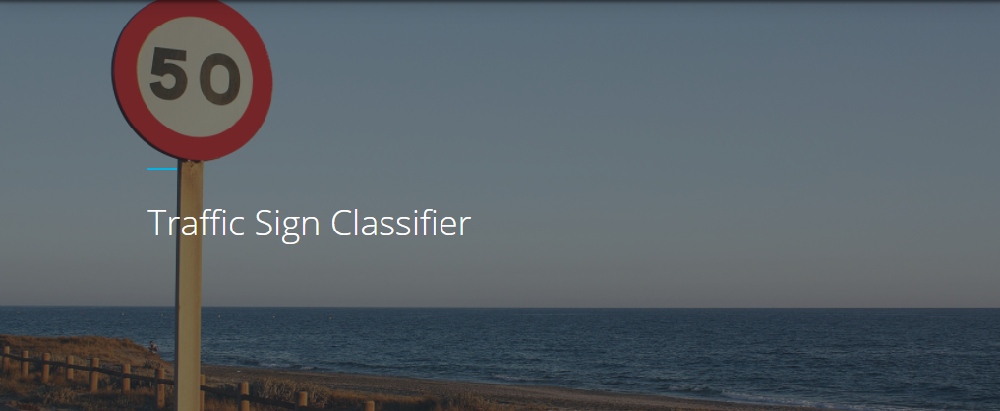
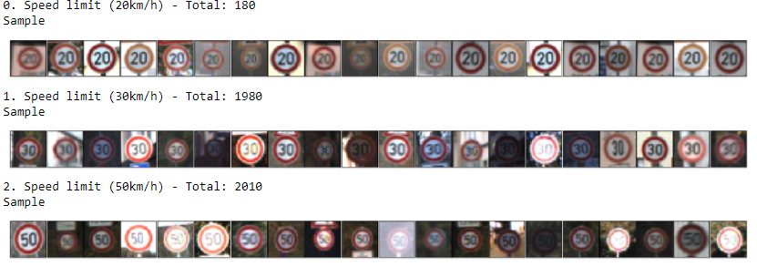
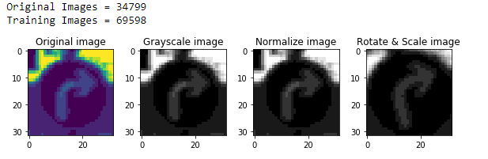
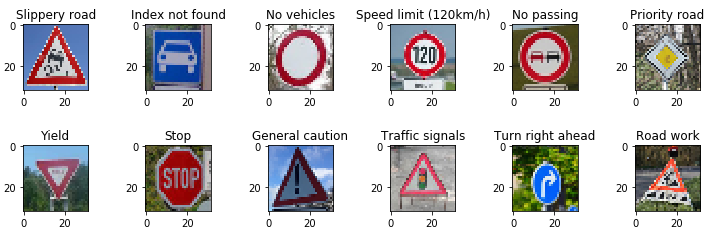
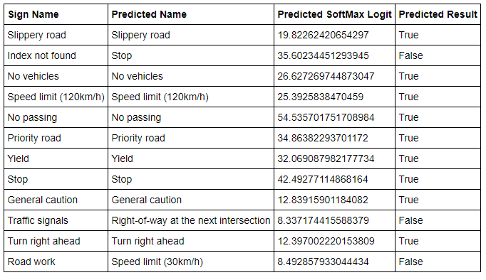
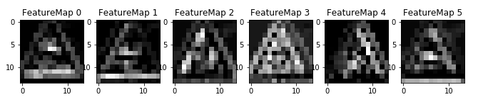

## Traffic Sign Recognition

Overview
---
In this project, we will use deep neural networks and convolutional neural networks to classify traffic signs. Specifically, we will train a model to classify traffic signs from the German Traffic Sign Dataset. The trained model is then tested on German traffic signs found on the web.

Goals
---
* Step 1: Load the data set (see below for links to the project data set)
* Step 2: Explore, summarize and visualize the data set
* Step 3: Design, train and test a model architecture
* Step 4: Use the model to make predictions on new images
* Step 5: Analyze the softmax probabilities of the new images
* Step 6: Summarize the results with a written report

Files
---
* [Traffic_Sign_Classifier.ipynb](https://github.com/vinayakkankanwadi/CarND-Traffic-Sign-Classifier-Project/blob/master/Traffic_Sign_Classifier.ipynb) - Notebook file with all questions answered and all code cells executed and displaying output 
* [Report.html](https://github.com/vinayakkankanwadi/CarND-Traffic-Sign-Classifier-Project/blob/master/report.html) - An HTML export of the project notebook.
* [Test-Images](https://github.com/vinayakkankanwadi/CarND-Traffic-Sign-Classifier-Project/tree/master/test-images)- Images used for the project that are not from the German Traffic Sign Dataset.
* [German Traffic Sign Dataset ZIP](https://d17h27t6h515a5.cloudfront.net/topher/2017/February/5898cd6f_traffic-signs-data/traffic-signs-data.zip) - This is not included NEED TO BE DOWNLOADED, UNZIPPED and copy train.p, test.p and valid.p to [Traffic-signs-data](https://github.com/vinayakkankanwadi/CarND-Traffic-Sign-Classifier-Project/tree/master/traffic-signs-data) folder.
* [README.md](https://github.com/vinayakkankanwadi/CarND-Traffic-Sign-Classifier-Project/blob/master/README.md) - Writeup report as a markdown to reflect the work.

---

### Step 1: Data Set Summary & Exploration

#### 1a. Dataset Summary

I used the pandas library to calculate summary statistics of the traffic signs data set:

* The size of training set is 34799
* The size of test set is 12630
* The shape of a traffic sign image is (32, 32, 3)
* The number of unique classes/labels in the data set is 43

#### 1b. Exploratory Visualization

The bar chart shows the data distribution of the training, testing and validation data. Each bar represents one class (traffic sign) and how many samples are in their respective class distribution. The mapping of traffic sign names to class id can be found here: [signnames.csv](./signnames.csv)

Sample traffic signs from the training data set. More can be found in the [jupyter notebook](./Traffic_Sign_Classifier.ipynb).

---

### Step 2: Design and Test a Model Architecture

#### 2a. Preprocessing
Steps
- Convert to Grayscale - Color unlikely to give any performance boost.
- Normalization - to reduce the number of shades.
- AUGMENT THE TRAINING DATA - generate additional dataset - common technique to improve model's precision. Rotate(15 degree) and Scale(1.25 percentage) used.

Here is an example of an original image and pre-processed image:

#### 2b. Model Architecture

Convolutional neuronal network Model is used to classify the traffic signs. The input of the network is an 32x32x1 image and the output is the probabilty of each of the 43 possible traffic signs.
 
 Model consisted of the following layers:

| Layer         		|     Description	        					| Input |Output| 
|:---------------------:|:---------------------------------------------:| :----:|:-----:|
| Convolution 5x5     	| 1x1 stride, valid padding, RELU activation 	|**32x32x1**|28x28x6|
| Max pooling			| 2x2 stride		|28x28x6|14x14x6|
| Convolution 5x5 	    | 1x1 stride, valid padding, RELU activation 	|14x14x6|10x10x16|
| Max pooling			| 2x2 stride	   					|10x10x16|5x5x16|
| Flatten				| 3 dimensions -> 1 dimension					|5x5x16| 400|
| Fully Connected | connect, RELU, Dropout (keep prob = 0.75)			|400|120|
| Fully Connected | connect, RELU, Dropout (keep prob = 0.75)   |120|84|
| Fully Connected | connect, RELU, Dropout (keep prob = 0.75)  	|84|**43**|

#### 2c. Model Training
Model was trained on local machine with a GPU (NVIDA GeForce GT 840 M).
The following global parameters were used to train the model.
* EPOCHS = 50
* BATCH SIZE = 128
* SIGMA = 0.1
* DROPOUT = 0.75
* OPIMIZER: AdamOptimizer (LEARNING RATE = 0.001)

#### 2d. Solution Approach
**Expected validation set accuracy to be at least 0.93**

This solution based on modified LeNet-5 architecture. With the original LeNet-5 architecture, which resulted in validation set accuracy of about 0.921. 

Adjustments:
* Additional augmented training data generated.
* Input shape was modified from 32x32x3 on using preprocessed images to shape of 32x32x1. 
* Initially used epochs of 10 which resulted validation accuracy of 0.93. 
* Increasing the epoch to 35 gave validation accuracy above 0.95.  
* Training for more than 35 epochs did not increase the validation accuracy much however was trained for 50 epochs.
* Dropout - keep probabily were in range 0.6-0.8.

**Final model results:**
* Training Accuracy = **99.9%**
* Validation Accuracy = **96.0%**
* Testing Accuracy = **94.3%**

---

### Step 3: Test a Model on New Images

#### 3a. Acquiring New Images

Following are the German traffic signs used to test the model on New Images

Quality or qualities might be difficult to classify

* Image1  - confusing rotated inside
* Image2  - image not in classification
* Image3  - confusing with speed
* Image4  - confusing with other speeds
* Image5  - confusing image inside
* Image6  - noisy background
* Image7  - noisy background
* Image8  - angled image
* Image9  - rotated image
* Image10 - noisy background
* Image11 - angled image
* Image12 - noisy background

#### 3b.Performance on New Images

Here are the results of the prediction:

The model was able to correctly guess 9 of the 12 traffic signs, which gives an accuracy of **75%**. This compares favorably to the accuracy on the test set of **94.3**

#### 3c.Model Certainty - Softmax Probabilities

**Predictions:**
* Image 1 - [ 0.99664  0.00336  0.       0.       0.     ]
* Image 2 - [ 0.99999  0.       0.       0.       0.     ]
* Image 3 - [ 1.       0.       0.       0.       0.     ]
* Image 4 - [ 0.98404  0.01327  0.00269  0.       0.     ]
* Image 5 - [ 1.       0.       0.       0.       0.     ]
* Image 6 - [ 1.       0.       0.       0.       0.     ]
* Image 7 - [ 1.       0.       0.       0.       0.     ]
* Image 8 - [ 1.       0.       0.       0.       0.     ]
* Image 9 - [ 0.99879  0.00071  0.00021  0.00015  0.00006]
* Image10 - [ 0.79382  0.2033   0.00107  0.00075  0.00037]
* Image11 - [ 0.96896  0.03103  0.       0.       0.     ]
* Image12 - [ 0.94491  0.05347  0.001    0.00035  0.00008]

**Labels:**
* Image 1 - [23 20 10 11 38] - **Slippery road**
* Image 2 - [14 17 34 38  9] - **Stop**
* Image 3 - [15 12 26  4  9] - **No vehicles**
* Image 4 - [ 8  2  3  5  7] - **Speed limit (120km/h)**
* Image 5 - [ 9 16 12 10 35] - **No passing**
* Image 6 - [12 25 15  9  3] - **Priority road**
* Image 7 - [13  8 38  3 14] - **Yield**
* Image 8 - [14 38 34 13  2] - **Stop**
* Image 9 - [18 25 29 26 20] - **General caution**
* Image10 - [11 18 27 24 25] - **Right-of-way at the next intersection**
* Image11 - [33 26 14 35  4] - **Turn right ahead**
* Image12 - [ 1 31  2 28 29] - **Speed limit (30km/h)**

Images the model was not able to classify accurately
* Image2  - label 99 - This label is not present in classifier.
* Image10 - Correct label 26 (Traffic Signal) - This is not in SoftMax probability of 5
* Image12 - Correct label 25 (Road Work) - This is not in SoftMax probability of 5

**This probably indicates when it is certain it is reflecting in probability 1 and when it is not it does not make it into max 5 probability.**

### (Optional) Visualizing the Neural Network
#### Example 
* Layer 1 - Convolution - It's possible to see shape of sign however with backgound noize.
* ReLU-activation Noize level significantly reduced. 
* Max-pooling - Image size reduced however important features are present.

---
